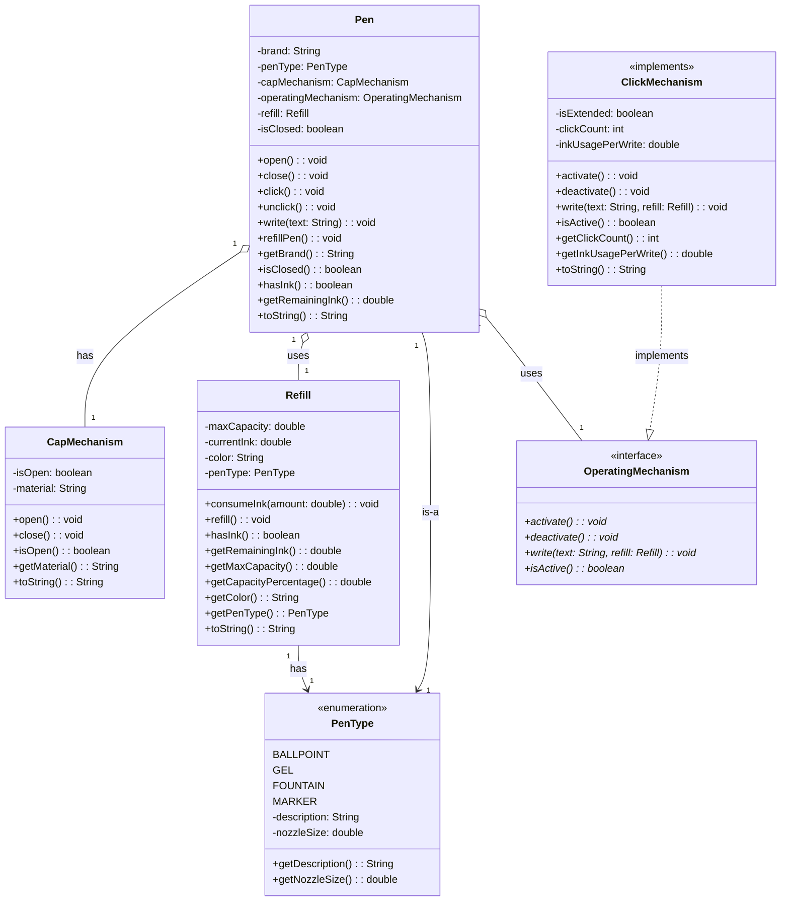

# Pen Design - Class Diagram

```mermaid
classDiagram
    class Pen {
        -brand: String
        -penType: PenType
        -capMechanism: CapMechanism
        -operatingMechanism: OperatingMechanism
        -refill: Refill
        -isClosed: boolean
        +open(): void
        +close(): void
        +click(): void
        +unclick(): void
        +write(text: String): void
        +refillPen(): void
        +getBrand(): String
        +isClosed(): boolean
        +hasInk(): boolean
        +getRemainingInk(): double
        +toString(): String
    }

    class PenType {
        <<enumeration>>
        BALLPOINT
        GEL
        FOUNTAIN
        MARKER
        -description: String
        -nozzleSize: double
        +getDescription(): String
        +getNozzleSize(): double
    }

    class CapMechanism {
        -isOpen: boolean
        -material: String
        +open(): void
        +close(): void
        +isOpen(): boolean
        +getMaterial(): String
        +toString(): String
    }

    class Refill {
        -maxCapacity: double
        -currentInk: double
        -color: String
        -penType: PenType
        +consumeInk(amount: double): void
        +refill(): void
        +hasInk(): boolean
        +getRemainingInk(): double
        +getMaxCapacity(): double
        +getCapacityPercentage(): double
        +getColor(): String
        +getPenType(): PenType
        +toString(): String
    }

    class OperatingMechanism {
        <<interface>>
        +activate(): void*
        +deactivate(): void*
        +write(text: String, refill: Refill): void*
        +isActive(): boolean*
    }

    class ClickMechanism {
        <<implements>>
        -isExtended: boolean
        -clickCount: int
        -inkUsagePerWrite: double
        +activate(): void
        +deactivate(): void
        +write(text: String, refill: Refill): void
        +isActive(): boolean
        +getClickCount(): int
        +getInkUsagePerWrite(): double
        +toString(): String
    }

    Pen "1" o-- "1" CapMechanism : has
    Pen "1" o-- "1" Refill : uses
    Pen "1" --> "1" PenType : is-a
    Pen "1" o-- "1" OperatingMechanism : uses
    ClickMechanism ..|> OperatingMechanism : implements
    Refill "1" --> "1" PenType : has
```
