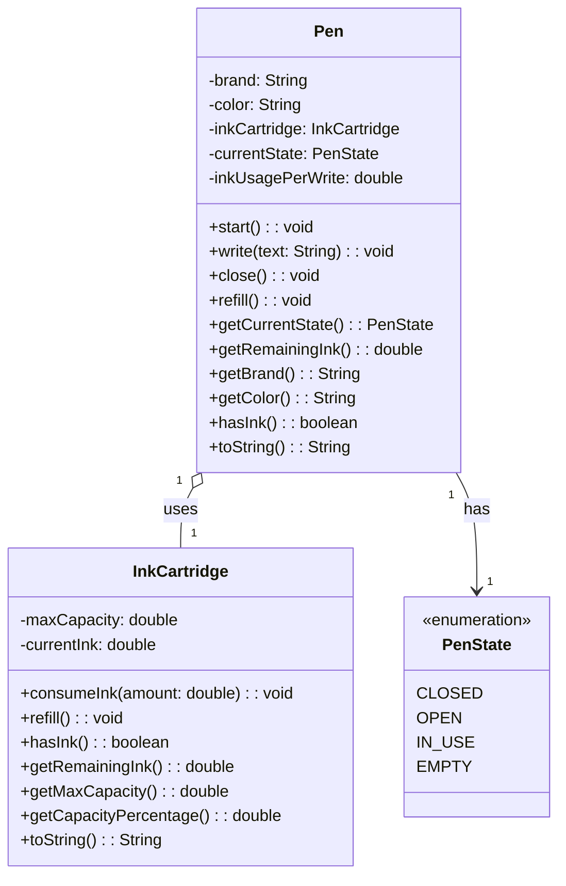
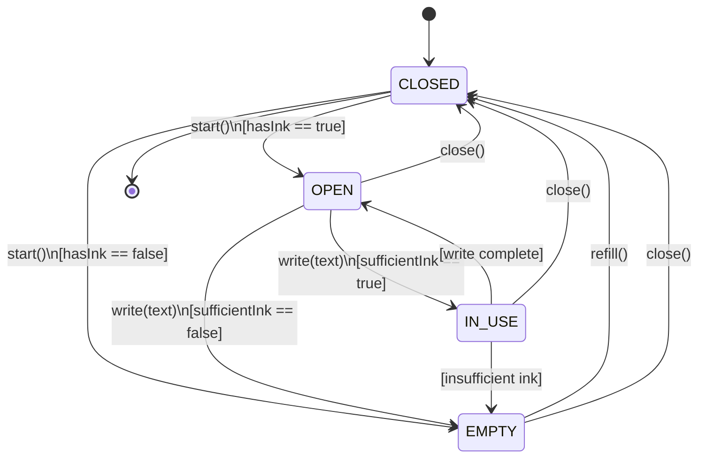
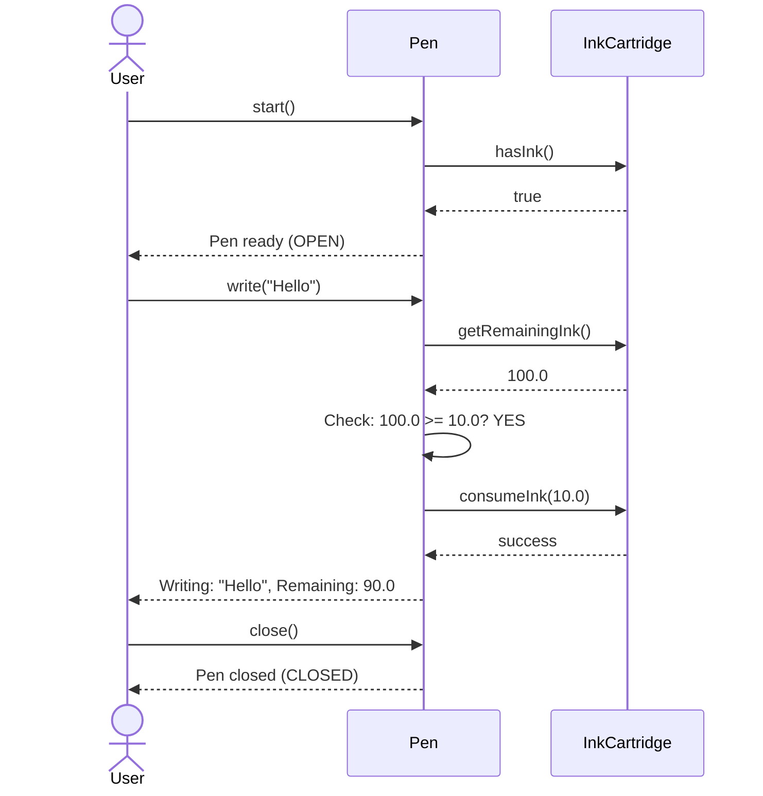
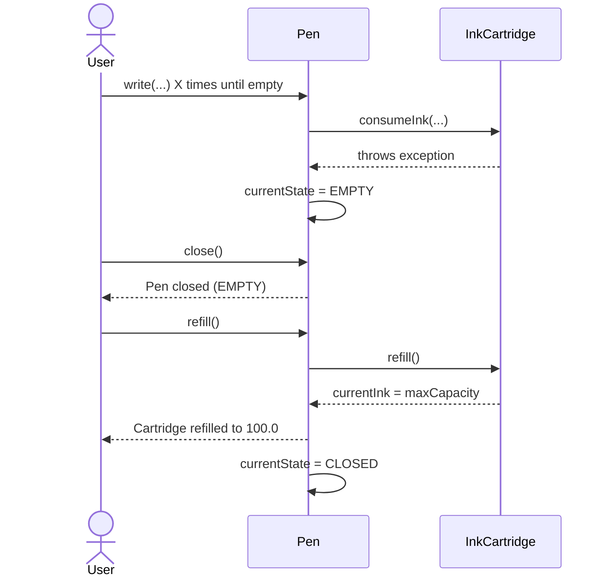

# Low-Level Design (LLD) - Pen System

## Overview

A comprehensive object-oriented design of a Pen system that models real-world pen behavior with state management, ink tracking, and error handling. The system follows SOLID principles with clear separation of concerns between the Pen class (lifecycle management) and InkCartridge class (ink management).

### Objectives
- Model a pen with realistic behaviors (start, write, close, refill)
- Implement state machine pattern for pen states
- Manage ink consumption and capacity tracking
- Enforce valid state transitions through exception handling
- Maintain data encapsulation and code clarity

---

## 1. Class Diagram



---

## 2. State Diagram



### State Descriptions

| State | Description | Valid Transitions |
|-------|-------------|------------------|
| **CLOSED** | Pen cap is on, cannot write | start() → OPEN/EMPTY |
| **OPEN** | Cap removed, ready to write | write() → IN_USE/EMPTY, close() → CLOSED |
| **IN_USE** | Currently writing | (auto) → OPEN, write() again → IN_USE/EMPTY, close() → CLOSED |
| **EMPTY** | No ink left | close() → CLOSED, refill() → CLOSED |

---

## 3. Method Behavior Specifications

## 3. Method Behavior Specifications

### Pen Class

#### `Pen(brand, color, initialInkCapacity, inkUsagePerWrite)`
| Aspect | Detail |
|--------|--------|
| **Purpose** | Initialize a new pen with specified properties |
| **Parameters** | brand (String), color (String), initialInkCapacity (double), inkUsagePerWrite (double) |
| **Initial State** | CLOSED |
| **Initial Ink** | maxCapacity = initialInkCapacity, currentInk = initialInkCapacity |

#### `start(): void`
| Aspect | Detail |
|--------|--------|
| **Precondition** | currentState == CLOSED |
| **Action** | Check ink availability |
| **Postcondition (Success)** | currentState = OPEN, message printed |
| **Postcondition (Failure)** | currentState = EMPTY, throws IllegalStateException |
| **Throws** | IllegalStateException - if pen not CLOSED or no ink available |

#### `write(text: String): void`
| Aspect | Detail |
|--------|--------|
| **Precondition** | currentState in {OPEN, IN_USE}, sufficient ink available |
| **Action** | Consume ink, print message with remaining ink |
| **Ink Check** | remainingInk >= inkUsagePerWrite |
| **Postcondition (Success)** | currentState = OPEN, inkCartridge.currentInk reduced |
| **Postcondition (Failure)** | currentState = EMPTY, throws IllegalStateException |
| **Throws** | IllegalStateException - if pen not open or insufficient ink |

#### `close(): void`
| Aspect | Detail |
|--------|--------|
| **Precondition** | currentState != CLOSED |
| **Action** | Place cap on pen, preserve ink |
| **Postcondition** | currentState = CLOSED, message printed |
| **Throws** | IllegalStateException - if already closed |

#### `refill(): void`
| Aspect | Detail |
|--------|--------|
| **Precondition** | currentState in {CLOSED, EMPTY} |
| **Action** | Restore ink to full capacity |
| **Postcondition** | currentState = CLOSED, currentInk = maxCapacity |
| **Throws** | IllegalStateException - if pen is OPEN or IN_USE |

#### Getter Methods
```
getCurrentState() → PenState
getRemainingInk() → double
getBrand() → String
getColor() → String
hasInk() → boolean
toString() → String
```

### InkCartridge Class

#### `consumeInk(amount: double): void`
| Aspect | Detail |
|--------|--------|
| **Precondition** | currentInk >= amount |
| **Action** | Deduct amount from currentInk |
| **Postcondition** | currentInk = (previous currentInk - amount) |
| **Throws** | IllegalStateException - if insufficient ink |

#### `refill(): void`
| Aspect | Detail |
|--------|--------|
| **Postcondition** | currentInk = maxCapacity |
| **Effect** | Restores ink to full capacity |

#### `hasInk(): boolean`
| Return Value | Condition |
|-------------|-----------|
| true | currentInk > 0 |
| false | currentInk == 0 |

#### Getter Methods
```
getRemainingInk() → double
getMaxCapacity() → double
getCapacityPercentage() → double (0-100)
toString() → String
```

---

## 4. Sequence Diagram - Normal Write Operation



---

## 5. Sequence Diagram - Refill Operation



---

## 6. Component Design

```java
Pen pen = new Pen("Parker", "Blue", 100.0, 10.0);

pen.start();                    // CLOSED → OPEN (if ink exists)
pen.write("Hello, World!");     // OPEN → IN_USE → OPEN (consumes 10 units)
pen.write("Another message");   // OPEN → IN_USE → OPEN
pen.close();                    // OPEN → CLOSED
pen.refill();                   // CLOSED → CLOSED (ink restored)
pen.start();                    // CLOSED → OPEN
```

## 6. Component Design

### Pen Class - Responsibilities
- **Lifecycle Management**: Manage pen state transitions (CLOSED → OPEN → IN_USE/EMPTY → CLOSED)
- **Ink Coordination**: Delegate ink operations to InkCartridge while enforcing business rules
- **State Enforcement**: Validate preconditions for each operation
- **Error Handling**: Throw exceptions for invalid state transitions

### InkCartridge Class - Responsibilities
- **Ink Storage**: Maintain maxCapacity and currentInk
- **Capacity Management**: Track and provide methods to query/modify ink levels
- **Encapsulation**: Hide ink management details from external callers
- **Validation**: Ensure ink operations don't exceed bounds

### Architecture Pattern: Composition
```
Pen (Composition)
├── InkCartridge (owned by Pen)
│   ├── maxCapacity: double
│   └── currentInk: double
└── PenState: enum
    ├── CLOSED
    ├── OPEN
    ├── IN_USE
    └── EMPTY
```

---

## 7. Error Handling Strategy

| Error Scenario | Exception Type | Error Message | Recovery |
|---|---|---|---|
| start() when not CLOSED | IllegalStateException | "Pen is already open or in use. Close it first." | Call close() then start() |
| start() with no ink | IllegalStateException | "Cannot start pen: No ink available" | Call refill() then start() |
| write() when not OPEN/IN_USE | IllegalStateException | "Pen is not open. Call start() first." | Call start() then write() |
| write() with insufficient ink | IllegalStateException | "Insufficient ink for this write operation" | Call refill() then write() |
| close() when already CLOSED | IllegalStateException | "Pen is already closed." | Skip redundant close() |
| refill() when OPEN or IN_USE | IllegalStateException | "Cannot refill while pen is open. Close the pen first." | Call close() then refill() |

---

## 8. Design Principles & Patterns

### SOLID Principles Applied
- **Single Responsibility**: Pen manages lifecycle, InkCartridge manages ink
- **Open/Closed**: System is open for extension (new ink types via inheritance) but closed for modification
- **Liskov Substitution**: All state transitions follow contract guarantees
- **Interface Segregation**: Each class exposes only necessary methods
- **Dependency Inversion**: Pen depends on InkCartridge abstraction

### Design Patterns Used
- **State Pattern**: PenState enum with state-specific transitions
- **Composition Pattern**: Pen "has-a" InkCartridge relationship
- **Encapsulation**: All attributes private, accessed via getters
- **Fail-Fast**: Exceptions thrown immediately on invalid operations

---

## 9. Usage Example

```java
// Basic usage
Pen pen = new Pen("Parker", "Blue", 100.0, 10.0);

try {
    pen.start();                    // CLOSED → OPEN
    pen.write("Hello, World!");     // OPEN → IN_USE → OPEN
    pen.write("Another message");   // OPEN → IN_USE → OPEN
    System.out.println(pen);        // Display pen details
    
    pen.close();                    // OPEN → CLOSED
    pen.refill();                   // CLOSED → CLOSED (ink restored)
    
    pen.start();                    // CLOSED → OPEN
    pen.write("Writing after refill");  // OPEN → IN_USE → OPEN
    pen.close();                    // OPEN → CLOSED
    
} catch (IllegalStateException e) {
    System.err.println("Error: " + e.getMessage());
}
```

---

## 10. Key Design Decisions

| Decision | Rationale |
|----------|-----------|
| PenState as enum | Type-safe state representation, prevents invalid states |
| Composition over inheritance | InkCartridge is not a type of Pen, owns it |
| Exceptions for invalid states | Fail-fast principle, prevents corrupted state |
| Immutable pen properties | Brand and color should not change after creation |
| Private attributes | Encapsulation prevents invalid direct modifications |
| Two-phase write (IN_USE→OPEN) | Allows consecutive writes without reopening |
| Ink percentage tracking | Provides visibility into cartridge status |

---

## 11. Constraints & Assumptions

### Constraints
- Ink consumption per write is constant (`inkUsagePerWrite`)
- All ink values are non-negative (double precision)
- State transitions are atomic (no concurrent state modifications)
- Exception messages are logged/printed to System.out/err

### Assumptions
- Single-threaded usage (no synchronization)
- Ink capacity never exceeds maxCapacity after refill
- Brand and color are immutable property strings
- Write operations complete successfully or fail completely (no partial writes)

---

## 12. Testing Considerations

### Unit Test Scenarios
1. **State Transitions**: Verify all valid state transitions work correctly
2. **Invalid Operations**: Confirm IllegalStateException thrown for invalid operations
3. **Ink Consumption**: Verify correct ink deduction and remaining ink tracking
4. **Refill**: Confirm cartridge returns to full capacity after refill
5. **Edge Cases**: Test with zero ink, boundary ink amounts, multiple refills
6. **Getters**: Verify all getter methods return correct values

### Integration Test Scenarios
1. Complete pen lifecycle (start→write→close→refill→start→write→close)
2. Error recovery flows (exhausted ink → close → refill → restart)
3. Multiple consecutive writes with ink tracking

---

## 13. Notes & Future Enhancements

### Current Limitations
- Single ink cartridge type (monolithic design)
- No persistence of pen state
- No support for different ink colors during write
- No ink evaporation simulation

### Future Enhancements
- Support multiple cartridge types (standard, premium, refillable)
- Persistence layer for saving/loading pen state
- Ink color tracking independent of pen color
- Time-based ink evaporation for realistic simulation
- Pressure-based ink consumption (writing force affects consumption)
- Metrics/Analytics on pen usage patterns
