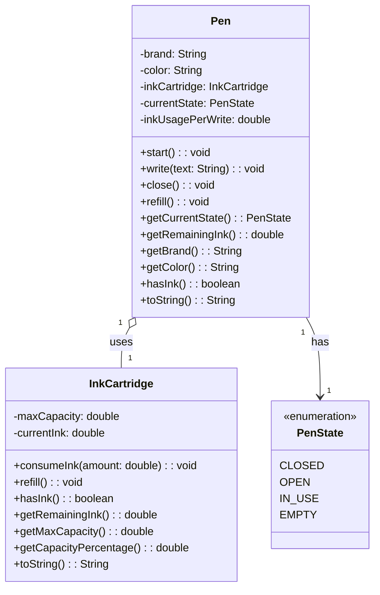

# Low-Level Design (LLD) - Pen System

```mermaid
classDiagram
    class Pen {
        -brand: String
        -color: String
        -inkCartridge: InkCartridge
        -currentState: PenState
        -inkUsagePerWrite: double
        +start(): void
        +write(text: String): void
        +close(): void
        +refill(): void
        +getCurrentState(): PenState
        +getRemainingInk(): double
        +getBrand(): String
        +getColor(): String
        +hasInk(): boolean
        +toString(): String
    }

    class InkCartridge {
        -maxCapacity: double
        -currentInk: double
        +consumeInk(amount: double): void
        +refill(): void
        +hasInk(): boolean
        +getRemainingInk(): double
        +getMaxCapacity(): double
        +getCapacityPercentage(): double
        +toString(): String
    }

    class PenState {
        <<enumeration>>
        CLOSED
        OPEN
        IN_USE
        EMPTY
    }

    Pen "1" o-- "1" InkCartridge : uses
    Pen "1" --> "1" PenState : has
```
